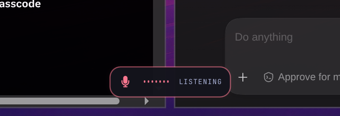

# Voxtype Signal OSD

User-owned Quickshell implementation of the selected **Signal** Voxtype indicator.



- Card: 156 × 40 px, bottom-center, 24 px screen margin; 168 × 48 px click-through carrier.
- States: live recording levels, streaming, transcribing, and a 650 ms ready confirmation.
- Colors: follows the active Omarchy palette through `~/.local/state/omarchy/current/theme/colors.toml`.
- Placement: follows the focused Hyprland monitor.
- Input: empty pointer region and no keyboard focus.
- A 6 px, 8%-opacity micro-halo softly diffuses the state color immediately around the card.

The deployed copy is at `~/.local/share/voxtype/quickshell-signal/`. The user-service drop-in `~/.config/systemd/user/voxtype.service.d/30-signal-osd.conf` sets `VOXTYPE_OSD_QML_PATH` to that directory, and `~/.config/voxtype/config.toml` selects `frontend = "quickshell"`.

See [ARCHITECTURE.md](ARCHITECTURE.md) for the startup chain and persistence boundaries, and [docs/design-qa.md](docs/design-qa.md) for the verified visual and runtime checks.

Installed on 2026-08-25. The restart also exposed a pre-existing invalid model name (`parakeet-tdt-0.6b-v2-int8`). The installed model and the immediately preceding successful service logs both identify the working model as `parakeet-tdt-0.6b-v2`, so the active config was reconciled to that exact name.

Backups:

- `~/.config/voxtype/config.toml.signal-20260825-005656.bak` is the byte-for-byte pre-install config. It preserves the invalid model name for forensic recovery and should not be restored wholesale.
- `~/.config/voxtype/config.toml.signal-rollback` is the known-good rollback config: working Parakeet v2 plus the previous `frontend = "native"` setting, which falls back to GTK4 on this installation.
- `~/.local/share/voxtype/quickshell-signal/SignalSurface.qml.long-halo.bak` preserves the first, stronger halo treatment.

## Preview

```bash
VOXTYPE_SIGNAL_PREVIEW_STATE=recording qs -p ./preview.qml
VOXTYPE_SIGNAL_PREVIEW_STATE=transcribing qs -p ./preview.qml
```

## Rollback

```bash
install -m 0644 ~/.config/voxtype/config.toml.signal-rollback ~/.config/voxtype/config.toml
mv ~/.config/systemd/user/voxtype.service.d/30-signal-osd.conf \
  ~/.config/systemd/user/voxtype.service.d/30-signal-osd.conf.disabled
systemctl --user daemon-reload
systemctl --user restart voxtype.service
```

Confirm that `voxtype-osd-gtk4` is again the OSD child. The custom QML directory can remain in place; without the drop-in and Quickshell frontend selection it is ignored. No packaged Voxtype or Omarchy file was modified.
