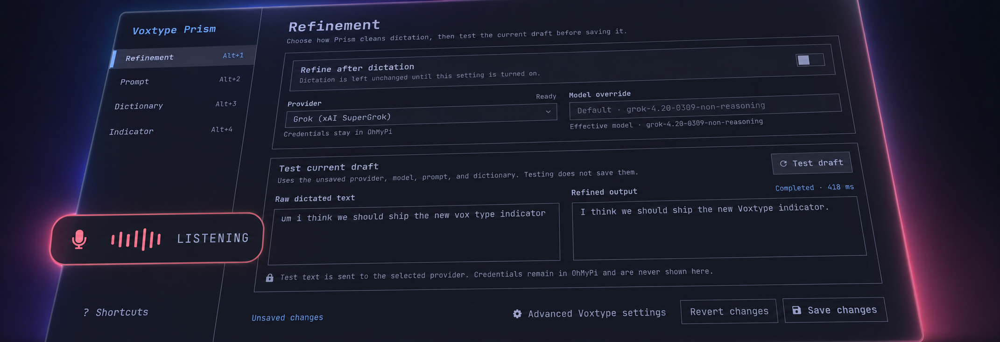

# Voxtype Prism

An Omarchy-native refinement and presentation studio for
[Voxtype](https://github.com/peteonrails/voxtype). Prism adds a graphical
**Refinement Workbench** plus three curated, theme-aware recording indicators.



- Native settings window for refinement, prompts, dictionary terms, and
  indicator appearance.
- Provider-aware transcript cleanup through Grok, Anthropic, OpenAI Codex, or
  a loopback local model.
- Explicit raw-versus-refined test bench; network calls happen only when the
  user clicks **Test refinement** or when Voxtype invokes the enabled hook.
- Signal, Halo, and Bar Pulse indicators driven by real microphone levels.
- Distinct listening, streaming, working, and ready states.
- Follows the focused Hyprland monitor.
- Uses an empty input region and never steals keyboard focus.
- Runs as Omarchy `service` and on-demand `panel` kinds inside the existing
  `omarchy-shell` process.
- Adds a separate Quick Shell **Voxtype Prism** launcher while preserving the
  native **Voxtype Configuration** app for upstream settings.
- Never loads watched config, runtime-state, or palette files into QML; a
  bounded, no-follow helper emits only normalized status tokens to
  `omarchy-shell`.

## Requirements

- Omarchy Quattro with shell-plugin support.
- Voxtype 0.7.5 or newer, running as `voxtype.service`.
- `/usr/bin/voxtype-audio-bridge` from the Voxtype package.
- Python 3 for the bounded reader, setup helper, and optional refine helper.
- `JetBrainsMono Nerd Font` for the state icons.

## Install

Add and enable the plugin:

```bash
omarchy plugin add https://github.com/jonhenshaw/voxtype-prism.git --enable --yes
```

Prism immediately shows a small **Activate Voxtype Prism** card. Click
**Activate** to explicitly hand visualizer ownership from Voxtype to Prism.
The action is part of the plugin, so standard installation requires no second
terminal command.

The activation action:

1. Reads the existing Voxtype config without changing unrelated settings.
2. Records whether Voxtype's built-in OSD was enabled.
3. Creates a timestamped backup.
4. Changes only `[osd] enabled` to `false` using an atomic write.
5. Restarts and verifies `voxtype.service`.

Signal stays dormant while the activation card is visible, so Prism never
duplicates the built-in Voxtype indicator.

The always-loaded service installs a guarded user-level
`voxtype-prism.desktop` entry. Searching Quick Shell for **Voxtype Prism** opens
the Refinement Workbench. The packaged **Voxtype Configuration** entry remains
available for engines, models, languages, hotkeys, audio, and output settings.
On upgrade, Prism removes only its earlier marked `voxtype-configure.desktop`
override; foreign user overrides and package files under `/usr/share` are never
modified.

If the activation card cannot be used, the same audited action remains
available as a fallback:

```bash
~/.config/omarchy/plugins/io.github.jonhenshaw.voxtype-prism/scripts/voxtype-prism-config setup
```

Check setup state at any time:

```bash
~/.config/omarchy/plugins/io.github.jonhenshaw.voxtype-prism/scripts/voxtype-prism-config status
```

## Refinement Workbench

Open **Voxtype Prism** from Quick Shell, or summon the panel directly:

```bash
omarchy-shell shell summon io.github.jonhenshaw.voxtype-prism '{}'
```

The workbench deliberately owns only Prism's enhancement layer:

- **Refinement** — enable the Voxtype post-process hook, choose a provider,
  inspect readiness, and compare raw text with an explicitly requested test.
- **Prompt** — edit the system instructions with a 32 KiB limit.
- **Dictionary** — keep preferred spellings and spoken-to-written mappings.
- **Indicator** — preview and select Signal, Halo, or Bar Pulse; choose top or
  bottom placement, scale, motion, and glow.

**Advanced Voxtype settings** closes Prism before opening Voxtype's packaged
TUI for engines, models, languages, hotkeys, audio, and output settings. Prism
does not duplicate that upstream surface.

Settings saves use an opaque revision. A concurrent TUI or file edit is
reported as a conflict instead of being overwritten. Prompt, dictionary,
provider, and indicator changes apply immediately; changing hook ownership
also restarts and verifies `voxtype.service`.

## Remove

First open the workbench, turn **Refinement** off, and save. This restores a
recorded pre-Prism post-process command when one existed, or removes Prism's
hook when it did not. Then remove Prism's separate launcher and restore the
exact OSD-enabled state recorded during activation before removing Prism:

```bash
~/.config/omarchy/plugins/io.github.jonhenshaw.voxtype-prism/scripts/voxtype-prism-launcher remove
~/.config/omarchy/plugins/io.github.jonhenshaw.voxtype-prism/scripts/voxtype-prism-config restore
omarchy plugin remove io.github.jonhenshaw.voxtype-prism --yes
```

The helper restores only `[osd] enabled`; it never rolls back or overwrites the
user's model, engine, hotkey, output, or other Voxtype settings.

## LLM refine CLI

Signal stays presentation-only. Transcript cleanup is a Voxtype post-process
command that runs `scripts/voxtype-refine` as a child of `voxtype.service`.
It reads OhMyPi credentials from `~/.omp/agent/agent.db` and never loads
tokens into `omarchy-shell`.

```bash
scripts/voxtype-refine list
scripts/voxtype-refine status
scripts/voxtype-refine set grok        # default
scripts/voxtype-refine set anthropic
scripts/voxtype-refine set openai
scripts/voxtype-refine set local
scripts/voxtype-refine prompt
scripts/voxtype-refine edit-prompt
scripts/voxtype-refine dictionary
scripts/voxtype-refine edit-dictionary


```

| id | provider | default model | notes |
| --- | --- | --- | --- |
| `grok` | xAI SuperGrok (`xai-oauth`) | `grok-4.20-0309-non-reasoning` | default |
| `anthropic` | Claude (`anthropic`) | `claude-haiku-4-5` | Haiku |
| `openai` | ChatGPT Codex (`openai-codex`) | `gpt-5.3-codex-spark` | ChatGPT subscription |
| `local` | llama.cpp on `:8000` | `Qwen3.8-27B-GGUF` | optional, slower |


Active selection lives in `~/.config/voxtype/refine.toml`. The workbench owns
the narrow `[output.post_process].command` integration. It recognizes the
earlier `~/.config/voxtype/llm-refine.py` Prism trampoline for migration, but
never overwrites an unknown post-process command.

The system prompt is `~/.config/voxtype/refine-prompt.md`. Edit that file or run
`scripts/voxtype-refine edit-prompt`.

The dictionary is `~/.config/voxtype/refine-dictionary.md`. Terms are appended
to the system prompt. Blank lines and `#` comments are ignored. Edit that file
or run `scripts/voxtype-refine edit-dictionary`. Changes apply on the next
dictation; no Voxtype restart.


Indicator preferences live in
`~/.config/voxtype-prism/indicator.json`. The runtime reader accepts only the
versioned preset, position, scale, motion, and glow schema and emits normalized
values to QML.

## Security and privacy boundaries

- `VoxtypeConfig.qml`, `StateReader.qml`, and `OmarchyPalette.qml` consume only
  small normalized values from `scripts/voxtype-prism-read`. The helper opens sources with
  `O_NOFOLLOW`, requires regular files, enforces byte ceilings before emitting
  anything, and normalizes unexpected input to a fail-closed state.
- Setup and settings state is read through descriptor-validated, size-limited regular-file
  boundary, strictly typed, and bound to the requested VoxType config path.
  Writes use randomized exclusive private temporary files, `fsync`, atomic
  replacement, optimistic revisions, and a private write-ahead journal that
  recovers interrupted multi-file saves without overwriting outside changes.
- Config updates compare the latest bounded snapshot immediately before atomic
  replacement and retry when VoxType or its TUI concurrently replaces the file,
  preserving unrelated settings.
- Credentials remain in `~/.omp/agent/agent.db`. The database must be a stable,
  bounded, non-symlink regular file, and only one bounded provider row is read.
  QML receives only readiness labels; tokens, account IDs, and authorization
  headers never cross the helper interface.
- `scripts/voxtype-refine` is the only network path. Remote providers receive
  the current transcript and, when Voxtype supplies it, recent dictation
  context. Provider responses and requests are bounded. Saving ordinary
  settings never performs a network test.
- The separate Quick Shell desktop entry is installed only when its target is
  absent or already carries Prism's ownership marker. Concurrent or foreign
  entries are preserved. Migration removes only the earlier Prism-marked
  configuration override, leaving native Voxtype settings independently
  discoverable.


## Development

```bash
python3 -m unittest discover -s tests -v
omarchy plugin validate .
tests/qml-lint.sh
tests/workbench-smoke.sh
tests/capture-workbench.sh /tmp/voxtype-prism-workbench.png
git diff --check
```

See [ARCHITECTURE.md](ARCHITECTURE.md) for lifecycle and failure boundaries,
[design-qa.md](design-qa.md) for the Refinement Workbench comparison, and
[docs/design-qa.md](docs/design-qa.md) for the runtime indicator comparison.

## License and attribution

MIT. `AudioBridge.qml` and `StateReader.qml` are adapted from Voxtype 0.7.5,
copyright Peter Jackson, under Voxtype's MIT license.
